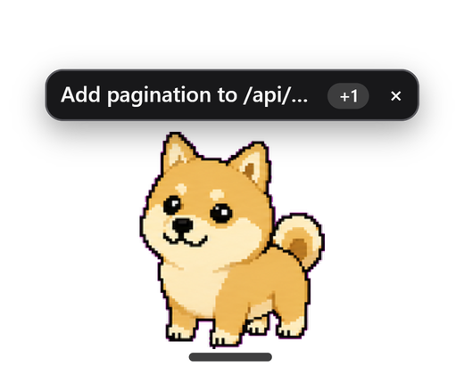

<div align="center">

<pre>
╔╦╗  ╔═╗  ╦  ╦    ╔═╗
 ║   ╠═╣  ║  ║    ╚═╗
 ╩   ╩ ╩  ╩  ╩═╝  ╚═╝
</pre>

### The Claude Code CLI, with a UI fully personalized to your preferences

**Claude Code UI** &nbsp;·&nbsp; a desktop app for the Claude Code terminal agent, where the
interface is something you ask for rather than something you are given.

<br>

[](https://github.com/SaifSyed08/tails/releases/latest)
[](https://claude.com/claude-code)
[](LICENSE)

[](https://electronjs.org)
[](https://react.dev)
[](https://typescriptlang.org)
[](#verification)

</div>

<table>
<tr>
<td width="33%" valign="top">

</td>
<td width="33%" valign="top">

</td>
<td width="33%" valign="top">

</td>
</tr>
<tr>
<td align="center"><sub><b>“make it look like an old amber terminal”</b></sub></td>
<td align="center"><sub><b>“make it feel like a warm paper notebook”</b></sub></td>
<td align="center"><sub><b>“cyberpunk neon, cyan and magenta”</b></sub></td>
</tr>
</table>

<div align="center">
<sub>Three messages, three turns, three themes. Nobody picked those colours and none of them is a
preset.</sub>
</div>

<div align="center">

`─────────────────────────  ✦  ─────────────────────────`

</div>

## Why this exists

Claude Code will refactor your codebase, run your tests and read your stack traces. It cannot
change the window it runs in, because that window is a terminal: one font, one grid, no images,
no panels, no idea who you are. A number, a chart, a warning and a plan all arrive the same way,
as scrolling text.

**T.A.I.L.S. gives the agent a real interface, then hands it the controls.**

It syncs with the Claude Code sessions you already have, so the chat you started in the terminal
this morning is in the sidebar. It supports local model integrations, so the same agent can run
against something on your own machine. It has wake word activation, so you can ask for something
without touching the keyboard. And it has a library of animated **pets** that keep an eye on your
favourite chats and tell you when one is finished.

Everything Claude Code can do, personalized to your way.



Underneath, it is the real thing. T.A.I.L.S. spawns the actual Claude Code CLI through the
[Claude Agent SDK](https://github.com/anthropics/claude-agent-sdk-typescript), so your
`CLAUDE.md`, your MCP servers, your settings and your permission prompts behave exactly as they do
in the terminal. Nothing is reimplemented. What is added is everything a terminal cannot have.

That includes knowing where to look. Assign a pet to a conversation and it sits out on your
desktop above whatever you are working in. When that chat finishes, it says so by name, and
clicking it takes you there. Two chats waiting means a name and a **+1**.

<br clear="right">

<div align="center">

`─────────────────────────  ✦  ─────────────────────────`

</div>

## ❶ &nbsp; Generative UI personalization

Ask the app to redesign itself, in the chat, in plain English. The agent composes a real theme
from a closed vocabulary of design primitives, previews two readings of the request when the
change is structural, and publishes the three or four knobs worth tuning afterwards.

A handful of looks ship with the app, and they are not the point. The three at the top of this
page each came from one sentence typed into the chat box.

▸ &nbsp;Scoped **per chat** or **everywhere**, so one conversation can be amber phosphor while
the rest of the app stays as it was
▸ &nbsp;A sanitised freeform-CSS layer for what the vocabulary cannot express: parsed, walked and
re-serialised from its own AST, so none of the model's bytes reach the renderer
▸ &nbsp;**Live panels** beside the conversation. Charts, tables, checklists, timelines and
monitors, composed by the agent and still updating after the turn ends
▸ &nbsp;**Scenes** behind the window. Weather, a starfield, a neon horizon, scrolling terrain,
or a playable game in the empty corner


<div align="center">

`─────────────────────────  ✦  ─────────────────────────`

</div>

## ❷ &nbsp; Local model routing

Point the same agent at a model on your own machine. T.A.I.L.S. discovers what is running,
translates between the Anthropic and OpenAI wire formats, and redirects the CLI's traffic to it.
The tools, the file editing and the permission prompts all behave the same way.

▸ &nbsp;Auto-discovers **Ollama**, **LM Studio**, **llama.cpp** and **vLLM**
▸ &nbsp;Offline, private and free, with the trade stated up front: local models are rated
conservatively and reported as not supporting tools, because guessing wrong there costs you more
than routing to the hosted model would have
▸ &nbsp;Speech is a separate decision with its own switch. On-device `whisper.cpp` by default,
cloud only if you say so


<div align="center">

`─────────────────────────  ✦  ─────────────────────────`

</div>

## ❸ &nbsp; Pets as session avatars

Give a conversation a character. A pet is a sprite that lives in the chat, walks the gutter, can
be picked up and thrown, put out onto your desktop above your other windows, and, if you want,
made to **speak as the assistant** rather than beside it.

<div align="center">

<br>
<sub>Seven of the thirteen on this machine. Each is a full sprite sheet with idle, walk, jump and
wave, and the shelf takes whatever you bring it.</sub>
</div>

▸ &nbsp;**Assigned per conversation.** Drag one onto a chat and that chat has a face in the
sidebar, so a list of twelve sessions stops being a list of twelve titles
▸ &nbsp;**It tells you when a chat is done**, by name, while the app is buried. Clicking the
bubble opens that conversation
▸ &nbsp;Three modes: a quiet sprite, an occasional commentator, or the voice of the reply itself
▸ &nbsp;Each carries its own persona, thinking phrases, theme and voice, local or ElevenLabs
▸ &nbsp;**Bring your own.** Import a sprite sheet and it joins the shelf, animations and all
▸ &nbsp;Out on the desktop its button is a **microphone**, because a pet you can see while the
app is buried is a pet you want to talk to


<div align="center">

`─────────────────────────  ✦  ─────────────────────────`

</div>

## And the rest

|  | |
|---|---|
| ⌨ &nbsp;**Queue, don't interrupt** | Type while a turn runs and the button becomes *queue*, not *stop* |
| ⏱ &nbsp;**Progress you can read** | Rows say *Reading* while reading, and the elapsed clock stays put for the whole turn |
| ⏻ &nbsp;**Voice mode** | Wake word, on-device transcription, and permission prompts you can answer out loud |
| ⚑ &nbsp;**Standing permissions** | "Always allow" that survives a restart, per tool and per folder, and can be taken back |
| ◈ &nbsp;**Five cold starts** | Pick the launch animation, with the real thing previewing beside the list |
| ⬒ &nbsp;**Preview pane** | The agent opens what it just built, loopback only |
| ⌘ &nbsp;**Built-in terminal** | A real PTY, for when you want the shell back |
| ⌾ &nbsp;**First-run setup** | Missing Node or CLI? It shows you the command, then runs it for you |


<div align="center">

`─────────────────────────  ✦  ─────────────────────────`

</div>

## Install

### ⬇ &nbsp;Windows, no build step

Grab **`TAILS-<version>-windows-x64-portable.zip`** from the
[latest release](https://github.com/SaifSyed08/tails/releases/latest), unzip it anywhere, and run
`TAILS.exe`. It writes nothing outside the folder you extracted it into, needs no administrator,
and uninstalls by deleting that folder. The build is unsigned, so SmartScreen will ask once:
"More info", then "Run anyway".

Prefer Start-menu shortcuts and a proper uninstaller? Take **`TAILS-Setup-<version>-x64.exe`**
from the same release instead. Both keep their state in `~/.tails`, so you can switch between
them and keep your conversations.

> **What you need first.** The [Claude Code CLI](https://claude.com/claude-code), signed in, and
> [Node.js](https://nodejs.org) 20+ to install it with. **If either is missing, the app offers to
> fix it on first run**: it shows you the exact download and the exact command, checks the Node
> installer against the checksum nodejs.org publishes, and lets Windows ask you to approve it.
> Signing in stays yours to do, in a terminal, because that part is a browser flow.

### ⌨ &nbsp;From source

```bash
git clone https://github.com/SaifSyed08/tails.git
cd tails
npm install

npm run dev          # API server + Vite client
npm run desktop      # the Electron window, in another shell
```

Optional, and only if you want them:

```bash
npm run vendor:whisper   # on-device speech recognition
npm run vendor:piper     # on-device text to speech
npm run dist:win         # build the installer and the portable zip yourself
```

<div align="center">

`─────────────────────────  ✦  ─────────────────────────`

</div>

## How it works

```
┌──────────────┐   websocket   ┌───────────────┐   Agent SDK   ┌──────────────┐
│   Electron   │ ◄───────────► │    Express    │ ◄───────────► │ Claude Code  │
│  React · TS  │     + REST    │   SQLite      │    (spawns)   │     CLI      │
└──────────────┘               └───────────────┘               └──────────────┘
       ▲                              │                               │
       │ theme spec · scenes          │ per-session state             │ your tools
       │ panels · pets                │ themes · pets · trust         │ your files
       └── generated at runtime ──────┘                               └── your machine
```

The server owns the state and the CLI; the renderer owns the drawing. Everything the agent can
change about the interface goes through a **closed vocabulary** validated server-side: the agent
names a widget kind, a theme primitive or a scene, and the app decides what that name draws. This
is the design decision the whole project rests on, and it is what makes "let the model rewrite the
UI" a feature rather than a footgun. A model that emits a name cannot emit an exploit.

The single place model-authored code runs is a custom scene, inside a sandboxed frame with no
same-origin access and no network at all.

## Scope

**Supported today.** Windows 10 and 11, x64, shipped as a portable zip and an NSIS installer. The
binaries are unsigned, so SmartScreen warns on first run. macOS and Linux build targets are not
wired up yet; the codebase carries no Windows-only dependencies, so that work is packaging rather
than porting.

**Security posture.** T.A.I.L.S. is a single-user desktop app. The server binds `127.0.0.1` and
carries no auth, because that binding is the boundary: nothing is exposed to the network, and
adding a login to a loopback socket would be theatre. Everything the agent may do to your machine
still goes through Claude Code's own permission gate, which this app renders rather than replaces.
Standing approvals are scoped per tool and per folder and can be revoked in Settings.

**Where your data lives.** `~/.tails`, on your disk. Conversations, themes, pets and trust
decisions, in a SQLite file you can delete. Nothing is uploaded anywhere the CLI would not have
sent it anyway, and the local-model path does not talk to Anthropic at all.

**Optional cloud voice.** ElevenLabs and AssemblyAI are wired in and gated behind your own key.
They are off unless you turn them on, and the on-device engines are the default path.

### Verification

602 tests, weighted toward the places where being wrong is silent: the spec validators and every
one of their refusal paths, the sanitiser, the spoken-permission grammar, the pet physics, the
state reducers, and the release-picking and checksum matching behind the Node installer.
`npm test`, `npm run typecheck` and `npm run lint` are all green on `master`.

<div align="center">

`─────────────────────────  ✦  ─────────────────────────`

</div>

## FAQ

<details>
<summary><b>What does T.A.I.L.S. stand for?</b></summary>
<br>

**Totally Awesome Intelligent Local Sidekick.** The dots are the brand; the Start-menu shortcut is
plain `TAILS`, because Windows Search splits a dotted name into five single letters and typing
"tails" would find nothing.

</details>

<details>
<summary><b>Is this a replacement for Claude Code?</b></summary>
<br>

No. It runs the real CLI as a subprocess through the Claude Agent SDK. Same agent, same tools,
same permissions, same `CLAUDE.md`, same MCP servers. If you uninstall T.A.I.L.S. tomorrow, your
Claude Code setup is untouched.

</details>

<details>
<summary><b>Will it see the sessions I started in the terminal?</b></summary>
<br>

Yes. Conversations you started in the terminal show up in the sidebar, and opening one adopts it
so you can carry on where you left off. It reads them through the SDK rather than parsing the
transcript files, so the format staying stable is not your problem.

</details>

<details>
<summary><b>Do I need an Anthropic subscription?</b></summary>
<br>

You need whatever the Claude Code CLI needs, which is a Claude account or an API key. Or point it
at a local model instead: with Ollama, LM Studio, llama.cpp or vLLM running, T.A.I.L.S. finds it
and routes the CLI's traffic there, and nothing leaves the machine.

</details>

<details>
<summary><b>Is it safe to let a model rewrite the interface?</b></summary>
<br>

That question is why the app is built the way it is. The agent never sends code for the UI to run.
It names things from a closed vocabulary, the server validates the name, and the app decides what
that name draws. A missing primitive is an error the agent has to report, not a gap it can fill
with markup.

The two exceptions are fenced. Freeform CSS is parsed into an AST and re-serialised, so none of
the model's own bytes reach the renderer, and it can never touch a permission prompt. A custom
scene runs in a sandboxed frame with no same-origin access and no network.

</details>

<details>
<summary><b>What do the pets actually do?</b></summary>
<br>

More than sit there. A pet assigned to a conversation gives it a face in the sidebar, can speak
the assistant's replies in its own voice, and, when it is out on your desktop, tells you by name
when that chat has finished so you do not have to keep checking. They also get thrown around and
land on things, which is less a feature than a consequence of giving them physics.

</details>

<details>
<summary><b>Can I add my own pet?</b></summary>
<br>

Yes. Import a sprite sheet with its frame grid and it joins the shelf, with its own persona,
thinking phrases, theme and voice.

</details>

<details>
<summary><b>Does it work on macOS or Linux?</b></summary>
<br>

Not yet, as a build. The code has no Windows-only dependencies, so running it from source on
another platform is a much shorter road than a port, but neither target is packaged or exercised
and this README will not pretend otherwise.

</details>

<details>
<summary><b>Why is the download so large?</b></summary>
<br>

Electron, plus the on-device speech engines that ship inside it so voice works without an account.
The Claude Code CLI itself is deliberately **not** bundled, which saves 300 MB and means the app
uses the copy you have already signed in to.

</details>

## License

[MIT](LICENSE) &nbsp;·&nbsp; Built on [Claude Code](https://claude.com/claude-code) and the
[Claude Agent SDK](https://github.com/anthropics/claude-agent-sdk-typescript).
Not affiliated with Anthropic.

<div align="center">
<br>

**Claude Code UI** · **Claude Code GUI** · **Claude Code desktop app** · **Claude Code interface**
· **AI coding assistant UI** · **generative UI** · **local LLM routing** · **Ollama** ·
**LM Studio** · **Electron**

</div>
