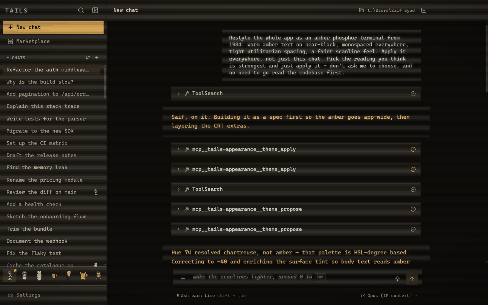
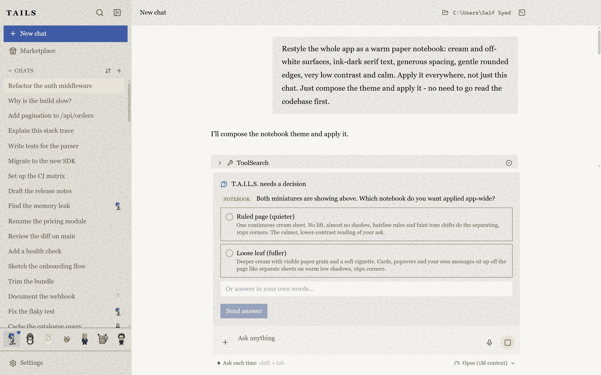
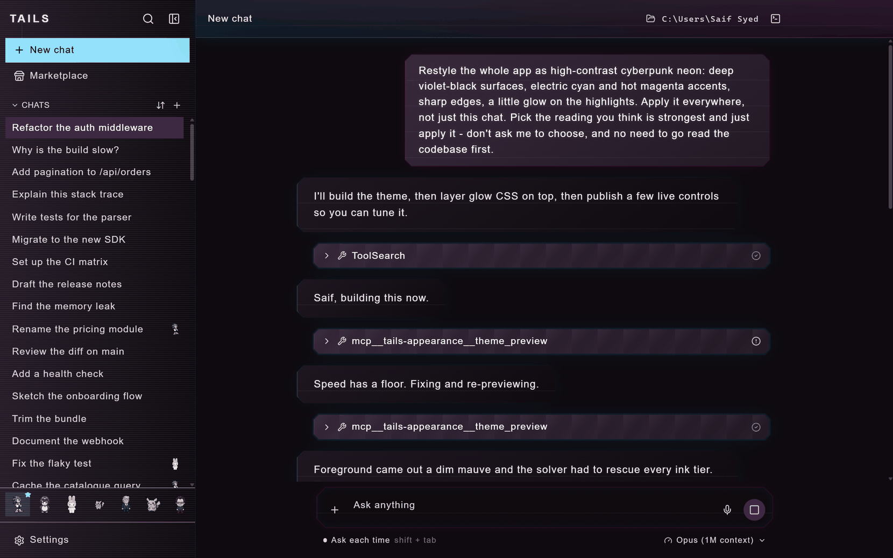

<div align="center">

<pre>
╔╦╗  ╔═╗  ╦  ╦    ╔═╗
 ║   ╠═╣  ║  ║    ╚═╗
 ╩   ╩ ╩  ╩  ╩═╝  ╚═╝
</pre>

### Claude Code UI &nbsp;·&nbsp; a desktop app for the Claude Code CLI

**The interface the agent can redesign, mid-conversation, because you asked it to.**

<br>

[](https://github.com/SaifSyed08/tails/releases/latest)
[](https://claude.com/claude-code)
[](LICENSE)

[](https://electronjs.org)
[](https://react.dev)
[](https://typescriptlang.org)
[](#verification)

<br>


</div>

<div align="center">

`─────────────────────────  ✦  ─────────────────────────`

</div>

## Why this exists

Claude Code will refactor your codebase, run your tests and read your stack traces. It cannot
change the window it runs in, because that window is a terminal: one font, one grid, no images,
no panels, no idea who you are. A number, a chart, a warning and a plan all arrive the same way,
as scrolling text.

**T.A.I.L.S. gives the agent a real interface, then hands it the controls.** Ask for a different
look and it composes one. Ask it to watch something and it builds a panel that keeps updating
after the turn ends. Point it at a model running on your own machine and everything else stays
exactly where it was.

This gets more useful as the models get better, not less. The limit on a coding agent is shifting
from what it can work out to what it can *show* you, and a terminal caps that at eighty columns
of monospace.

Underneath, it is the real thing: T.A.I.L.S. spawns the actual Claude Code CLI through the
[Claude Agent SDK](https://github.com/anthropics/claude-agent-sdk-typescript), so your
`CLAUDE.md`, your MCP servers, your settings and your permission prompts behave exactly as they
do in the terminal. Nothing is reimplemented. What is added is everything a terminal cannot have.

<div align="center">

`─────────────────────────  ✦  ─────────────────────────`

</div>

## ❶ &nbsp; Generative UI personalization

Ask the app to redesign itself, in the chat, in plain English. The agent composes a real theme
from a closed vocabulary of design primitives, previews two readings of the request when the
change is structural, and publishes the three or four knobs worth tuning afterwards.

A handful of looks ship with the app, and **they are not the point**. Ask for something they do
not cover and you get a new one, composed for the sentence you typed. Every screenshot below came
from a single message in the chat box: not one of them is a preset, and no human picked the
colours.

<table>
<tr>
<td width="50%" valign="top">

<br><sub><b>“an amber phosphor terminal from 1984”</b></sub>
</td>
<td width="50%" valign="top">

<br><sub><b>“a warm paper notebook, ink-dark serif, calm”</b></sub>
</td>
</tr>
<tr>
<td width="50%" valign="top">

<br><sub><b>“high-contrast cyberpunk neon, cyan and magenta”</b></sub>
</td>
<td width="50%" valign="top">

<br><sub><b>Whatever it makes lands here, scoped to one chat or all of them, and revertable. The panel is wearing the amber theme too.</b></sub>
</td>
</tr>
</table>

▸ &nbsp;Scoped **per chat** or **everywhere**, so one conversation can be amber phosphor while
the rest of the app stays as it was
▸ &nbsp;A sanitised freeform-CSS layer for what the vocabulary cannot express: parsed, walked and
re-serialised from its own AST, so none of the model's bytes reach the renderer
▸ &nbsp;**Live panels** beside the conversation. Charts, tables, checklists, timelines and
monitors, composed by the agent and still updating after the turn ends
▸ &nbsp;**Scenes** behind the window. Weather, a starfield, a neon horizon, scrolling terrain,
or a playable game in the empty corner

<div align="center">

`─────────────────────────  ✦  ─────────────────────────`

</div>

## ❷ &nbsp; Local model routing

Point the same agent at a model on your own machine. T.A.I.L.S. discovers what is running,
translates between the Anthropic and OpenAI wire formats, and redirects the CLI's traffic to it.
The tools, the file editing and the permission prompts all behave the same way.

▸ &nbsp;Auto-discovers **Ollama**, **LM Studio**, **llama.cpp** and **vLLM**
▸ &nbsp;Offline, private and free, with the trade stated up front: local models are rated
conservatively and reported as not supporting tools, because guessing wrong there costs you more
than routing to the hosted model would have
▸ &nbsp;Speech is a separate decision with its own switch. On-device `whisper.cpp` by default,
cloud only if you say so


<div align="center">

`─────────────────────────  ✦  ─────────────────────────`

</div>

## ❸ &nbsp; Pets as session avatars

Give a conversation a character. A pet is a sprite that lives in the chat, walks the gutter, can
be picked up and thrown, put out onto the desktop over your other windows, and, if you want, made
to **speak as the assistant** rather than beside it.

▸ &nbsp;**Assigned per conversation.** Drag one onto a chat and that chat has a face in the
sidebar, so a list of twelve sessions stops being a list of twelve titles
▸ &nbsp;Three modes: a quiet sprite, an occasional commentator, or the voice of the reply itself
▸ &nbsp;Each carries its own persona, thinking phrases, theme and voice, local or ElevenLabs
▸ &nbsp;Out on the desktop its button is a **microphone**, because a pet you can see while the
app is buried is a pet you want to talk to


<div align="center">

`─────────────────────────  ✦  ─────────────────────────`

</div>

## And the rest

|  | |
|---|---|
| ⌨ &nbsp;**Queue, don't interrupt** | Type while a turn runs and the button becomes *queue*, not *stop* |
| ⏱ &nbsp;**Progress you can read** | Rows say *Reading* while reading, and the elapsed clock stays put for the whole turn |
| ⏻ &nbsp;**Voice mode** | Wake word, on-device transcription, and permission prompts you can answer out loud |
| ⚑ &nbsp;**Standing permissions** | "Always allow" that survives a restart, per tool and per folder, and can be taken back |
| ◈ &nbsp;**Five cold starts** | Pick the launch animation, with the real thing previewing beside the list |
| ⬒ &nbsp;**Preview pane** | The agent opens what it just built, loopback only |
| ⌘ &nbsp;**Built-in terminal** | A real PTY, for when you want the shell back |
| ⌾ &nbsp;**First-run setup** | Detects a missing CLI and installs it for you, showing the command first |


<div align="center">

`─────────────────────────  ✦  ─────────────────────────`

</div>

## Install

> **You need** [Node.js](https://nodejs.org) 20+ and the
> [Claude Code CLI](https://claude.com/claude-code) signed in. If the CLI is missing, the app
> detects it on first run and offers to install it for you.

### ⬇ &nbsp;Windows, no build step

Grab **`TAILS-<version>-windows-x64-portable.zip`** from the
[latest release](https://github.com/SaifSyed08/tails/releases/latest), unzip it anywhere, and run
`TAILS.exe`. It writes nothing outside the folder you extracted it into, needs no administrator,
and uninstalls by deleting that folder. The build is unsigned, so SmartScreen will ask once:
"More info", then "Run anyway".

Prefer Start-menu shortcuts and a proper uninstaller? Take **`TAILS-Setup-<version>-x64.exe`**
from the same release instead. Both keep their state in `~/.tails`, so you can switch between
them and keep your conversations.

### ⌨ &nbsp;From source

```bash
git clone https://github.com/SaifSyed08/tails.git
cd tails
npm install

npm run dev          # API server + Vite client
npm run desktop      # the Electron window, in another shell
```

Optional, and only if you want them:

```bash
npm run vendor:whisper   # on-device speech recognition
npm run vendor:piper     # on-device text to speech
npm run dist:win         # build the installer and the portable zip yourself
```

<div align="center">

`─────────────────────────  ✦  ─────────────────────────`

</div>

## How it works

```
┌──────────────┐   websocket   ┌───────────────┐   Agent SDK   ┌──────────────┐
│   Electron   │ ◄───────────► │    Express    │ ◄───────────► │ Claude Code  │
│  React · TS  │     + REST    │   SQLite      │    (spawns)   │     CLI      │
└──────────────┘               └───────────────┘               └──────────────┘
       ▲                              │                               │
       │ theme spec · scenes          │ per-session state             │ your tools
       │ panels · pets                │ themes · pets · trust         │ your files
       └── generated at runtime ──────┘                               └── your machine
```

The server owns the state and the CLI; the renderer owns the drawing. Everything the agent can
change about the interface goes through a **closed vocabulary** validated server-side: the agent
names a widget kind, a theme primitive or a scene, and the app decides what that name draws. This
is the design decision the whole project rests on, and it is what makes "let the model rewrite the
UI" a feature rather than a footgun. A model that emits a name cannot emit an exploit.

The single place model-authored code runs is a custom scene, inside a sandboxed frame with no
same-origin access and no network at all.

## Scope

**Supported today.** Windows 10 and 11, x64, shipped as a portable zip and an NSIS installer.
The binaries are unsigned, so SmartScreen warns on first run and "More info" then "Run anyway"
is the way past it. macOS and Linux build targets are not wired up yet; the codebase carries no
Windows-only dependencies, so that work is packaging rather than porting.

**Security posture.** T.A.I.L.S. is a single-user desktop app. The server binds `127.0.0.1` and
carries no auth, because that binding is the boundary: nothing is exposed to the network, and
adding a login to a loopback socket would be theatre. Everything the agent may do to your machine
still goes through Claude Code's own permission gate, which this app renders rather than replaces.
Standing approvals are scoped per tool and per folder and can be revoked in Settings.

**Where your data lives.** `~/.tails`, on your disk. Conversations, themes, pets and trust
decisions, in a SQLite file you can delete. Nothing is uploaded anywhere the CLI would not have
sent it anyway, and the local-model path does not talk to Anthropic at all.

**Optional cloud voice.** ElevenLabs and AssemblyAI are wired in and gated behind your own key.
They are off unless you turn them on, and the on-device engines are the default path.

### Verification

587 tests, weighted toward the places where being wrong is silent: the spec validators and every
one of their refusal paths, the sanitiser, the spoken-permission grammar, the pet physics, and the
state reducers. `npm test`, `npm run typecheck` and `npm run lint` are all green on `master`.

## License

[MIT](LICENSE) &nbsp;·&nbsp; Built on [Claude Code](https://claude.com/claude-code) and the
[Claude Agent SDK](https://github.com/anthropics/claude-agent-sdk-typescript).
Not affiliated with Anthropic.

<div align="center">
<br>

**Claude Code UI** · **Claude Code GUI** · **Claude Code desktop app** · **Claude Code interface**
· **AI coding assistant UI** · **generative UI** · **local LLM routing** · **Ollama** ·
**LM Studio** · **Electron**

</div>
