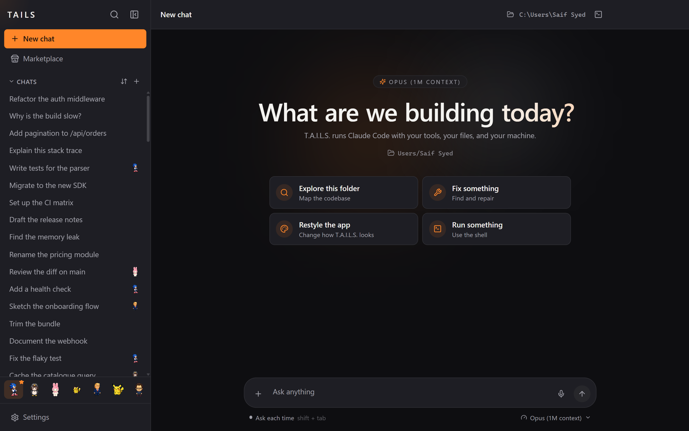
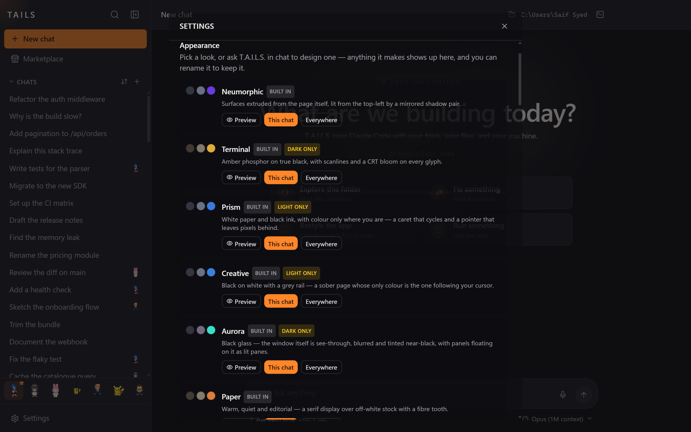
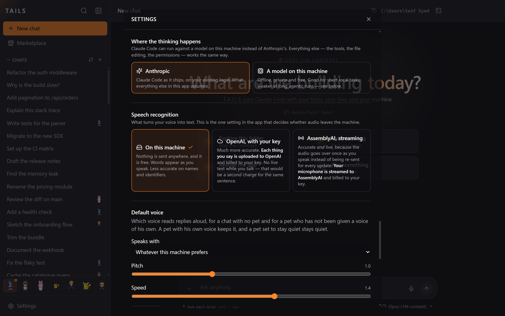
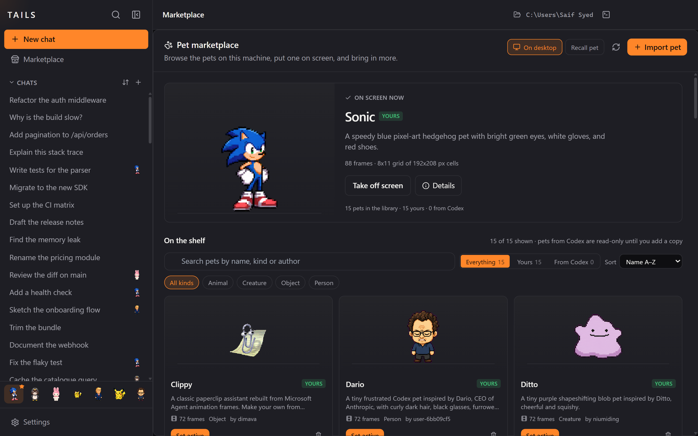
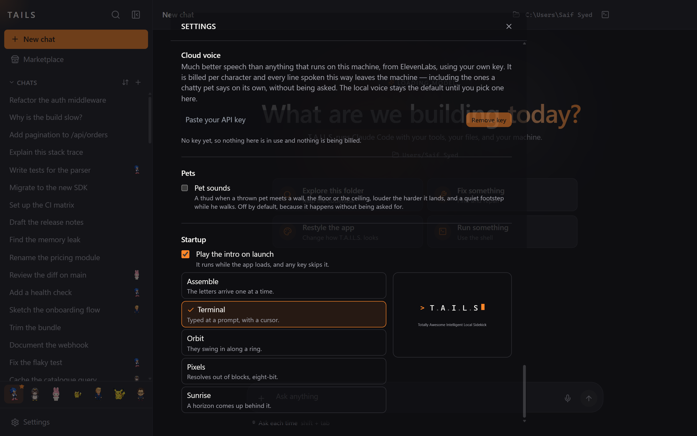

<div align="center">

<pre>
╔╦╗  ╔═╗  ╦  ╦    ╔═╗
 ║   ╠═╣  ║  ║    ╚═╗
 ╩   ╩ ╩  ╩  ╩═╝  ╚═╝
</pre>

### A desktop UI for Claude Code — that redesigns itself on request

**T.A.I.L.S.** puts a real interface on the Claude Code CLI: the same agent, the same tools,
the same permissions — in a window you can talk to, restyle by asking, point at a local model,
and give a character to.

<br>

[](LICENSE)
[](https://electronjs.org)
[](https://react.dev)
[](https://typescriptlang.org)

[](https://claude.com/claude-code)
[](#)
[](#install)
[](#status)

<br>



</div>

<div align="center">

`─────────────────────────  ✦  ─────────────────────────`

</div>

## What it is

Claude Code is a terminal agent. It is very good, and it is a terminal — which means every
question about *how it looks*, *where it thinks*, and *who you are talking to* has the same
answer: it doesn't, nowhere else, and nobody.

T.A.I.L.S. is a **GUI layer for Claude Code**. It spawns the real CLI through the
[Claude Agent SDK](https://github.com/anthropics/claude-agent-sdk-typescript), so your
`CLAUDE.md`, your MCP servers, your settings and your permission prompts all work exactly as
they do in the terminal. What it adds is everything a terminal cannot have.

<div align="center">

`─────────────────────────  ✦  ─────────────────────────`

</div>

## The three that matter

### ❶ &nbsp; Generative UI personalization

Ask the app to redesign itself, in the chat, in English. **"Make it feel like a terminal from
1984."** **"This is overwhelming — strip it back."** The agent composes a real theme from a
closed vocabulary of design primitives, shows you live miniatures of two readings when the
change is structural, and publishes the three or four knobs worth tuning afterwards.

Nothing here is a preset picker. The agent has tools, the tools have a guide, and what comes
back is a look nobody shipped.

▸ &nbsp;Scoped **per chat** or **everywhere**, so one conversation can be amber phosphor while
the rest of the app stays as it was
▸ &nbsp;A sanitised freeform-CSS layer for what the vocabulary cannot express — parsed,
walked and re-serialised from its own AST, so none of the model's bytes reach the renderer
▸ &nbsp;Scenes behind the window and panels beside it: weather, a neon horizon, a live monitor
watching a file, a game in the corner



<br>

### ❷ &nbsp; Local model routing

Point the same agent at a model on your own machine. T.A.I.L.S. discovers what is running,
translates between the Anthropic and OpenAI wire formats, and redirects the CLI's traffic to
it — the tools, the file editing and the permissions all behave the same way.

▸ &nbsp;Auto-discovers **Ollama**, **LM Studio**, **llama.cpp** and **vLLM**
▸ &nbsp;Offline, private, free — and honest about the trade: local models are rated
conservatively and reported as not supporting tools, because guessing wrong there fails you
more expensively than routing hosted
▸ &nbsp;Speech is a separate decision, with its own switch: on-device `whisper.cpp` by default,
cloud only if you say so



<br>

### ❸ &nbsp; Pets — an avatar per session

Give a conversation a character. A pet is a sprite that lives in the chat, walks around the
gutter, can be picked up and thrown, put out onto the desktop over your other windows — and,
if you want, **speaks as the assistant** rather than beside it.

▸ &nbsp;**Assigned per conversation** — drag one onto a chat and that chat has a face
▸ &nbsp;Three modes: a quiet sprite, an occasional commentator, or the voice of the reply itself
▸ &nbsp;Their own persona, thinking phrases, theme and voice — local, or ElevenLabs with your key
▸ &nbsp;Out on the desktop his button is a **microphone**, because a pet you can see while the
app is buried is a pet you want to talk to



<div align="center">

`─────────────────────────  ✦  ─────────────────────────`

</div>

## And the rest

|  | |
|---|---|
| ⌨ &nbsp;**Queue, don't interrupt** | Type while a turn runs and the button becomes *queue*, not *stop* |
| ◈ &nbsp;**Five cold starts** | Pick the launch animation, with the real thing previewing beside the list |
| ⏱ &nbsp;**Honest progress** | Rows say *Reading* while reading, and the elapsed clock stays put for the whole turn |
| ⏻ &nbsp;**Voice mode** | Wake word, on-device transcription, spoken permission prompts you can answer aloud |
| ▤ &nbsp;**Live panels** | Charts, tables, checklists and monitors the agent composes beside the conversation |
| ⚑ &nbsp;**Standing permissions** | "Always allow" that survives a restart, per tool and per folder, and can be taken back |
| ⬒ &nbsp;**Preview pane** | The agent opens what it just built, loopback only |
| ⌘ &nbsp;**Built-in terminal** | A real PTY, when you want the shell back |



<div align="center">

`─────────────────────────  ✦  ─────────────────────────`

</div>

## Install

> **Prerequisites** — [Node.js](https://nodejs.org) 20+, and the
> [Claude Code CLI](https://claude.com/claude-code) signed in.
> If the CLI is missing, the app detects it on first run and offers to install it for you.

```bash
git clone https://github.com/SaifSyed08/tails-app.git
cd tails-app
npm install

npm run dev          # API server + Vite client
npm run desktop      # the Electron window, in another shell
```

Optional, and only if you want them:

```bash
npm run vendor:whisper   # on-device speech recognition
npm run vendor:piper     # on-device text to speech
npm run dist:win         # a packaged Windows build
```

## How it works

```
┌──────────────┐   websocket   ┌───────────────┐   Agent SDK   ┌──────────────┐
│   Electron   │ ◄───────────► │    Express    │ ◄───────────► │ Claude Code  │
│  React · TS  │     + REST    │   SQLite      │    (spawns)   │     CLI      │
└──────────────┘               └───────────────┘               └──────────────┘
       ▲                              │                               │
       │ theme spec · scenes          │ per-session state             │ your tools
       │ panels · pets                │ themes · pets · trust         │ your files
       └── generated at runtime ──────┘                               └── your machine
```

The server owns state and the CLI; the renderer owns drawing. Everything the agent can change
about the interface goes through a **closed vocabulary** validated server-side — the agent names
a widget kind, a theme primitive or a scene, and the app decides what that means. The one place
model-authored code runs is a custom scene, inside a sandboxed frame with no same-origin access
and no network at all.

## Status

Alpha, and honest about it.

▸ &nbsp;**Windows-first.** The packaging script is `dist:win`; macOS and Linux are unexercised
▸ &nbsp;**Single user, loopback only.** The server binds `127.0.0.1` and has no auth — that
binding is the entire security boundary
▸ &nbsp;**Cloud voice is untested against the live APIs.** ElevenLabs and AssemblyAI are wired
and key-gated, but have not been run against the real services
▸ &nbsp;587 tests, covering the parts where a mistake is silent — validators, permission
grammar, physics, and every refusal path

## License

[MIT](LICENSE) · Built on [Claude Code](https://claude.com/claude-code) and the
[Claude Agent SDK](https://github.com/anthropics/claude-agent-sdk-typescript).

<div align="center">
<br>

**Claude Code GUI** · **Claude Code desktop app** · **AI coding assistant UI** · **generative UI**
· **local LLM routing** · **Ollama** · **LM Studio** · **Electron**

</div>
